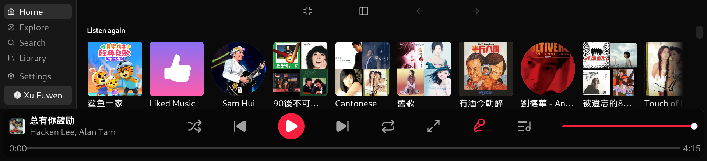
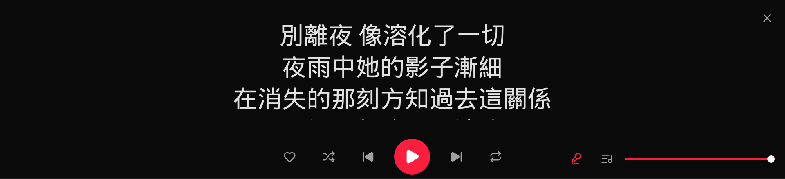
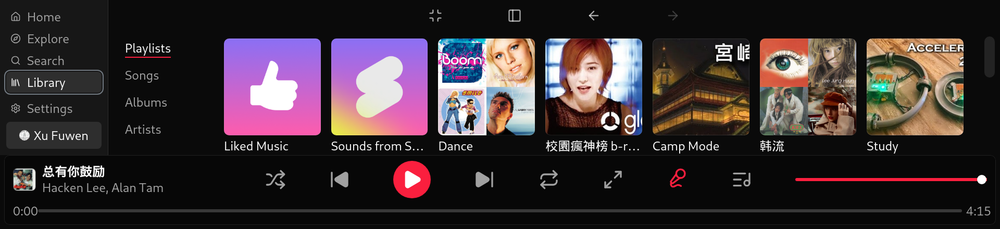

# Kodama-Lite

A fluid YouTube Music client for the Raspberry Pi 5 in-car display.

**Same UI, features, workflow and keyboard shortcuts as [YTMLite]**, rebuilt on a
decoupled, event-driven architecture inspired by **Kodama** — so the interface stays
at a locked 60 FPS even when the network is slow, unstable, or gone.

See **[DESIGN.md](./DESIGN.md)** for the full architecture proposal.



*Home, captured from the device. Page headings are gone and the cards are sized so a
whole row of artwork clears the fold — on a 238px content area that's the difference
between seeing a row and seeing the top third of one. The player bar gives the track a
quarter of its width and spreads the controls across the rest. Along the bottom: the
green **confirm-lyrics** button (left), then a seek bar with a real draggable thumb —
its 36px touch band is three times the visible line, because a 6px strip is not
something you hit at a traffic light.*



*The karaoke stage (`L`, or the top-right corner), captured mid-line. Three **fixed**
slots — previous, current, next — with the current line centred and never moving; an
earlier version scrolled a full list, which meant the line you were reading was in
motion for most of its own airtime. The sung/unsung edge sweeps continuously and
interpolates* inside *the word being sung, which is what makes it read as singing
rather than as words switching colour. Right cluster: search lyrics, lyrics source,
queue, volume. Closing is the same corner that opened it.*



*Library, on the **Local** tab. Sub-navigation runs down the left rather than across
the top: there are 1712 spare horizontal pixels and almost no vertical ones, and the
five tabs are spaced to clear the fold without scrolling. Local lists what is on the
USB stick — song, artist, length — with in-order / shuffle / repeat and a rescan. Note
"7 tracks": the drive holds eight files named `.mp3`, but one of them is actually WMA,
which WebKit cannot decode. The scan checks the codec rather than the extension, so it
never offers a track that would fail on tap.*

## The interface

Everything is built for one screen: a **1920x440** touch panel in a car, roughly 238px
of content once the top bar and player bar have taken their share. That constraint,
not taste, explains most of the layout decisions.

- **Home / Explore / Search** — horizontally scrolling shelves, sized so a full row of
  artwork clears the fold.
- **Library** — Playlists, Songs, Albums, Artists, and **Local**. Local scans a USB
  drive for MP3s and lists song, artist and length, with in-order / shuffle / repeat.
  It needs no account and no internet, so it keeps working when nothing else does.
  The first scan of a drive reads every file's tags and is slow — roughly a minute
  per thousand songs on a Pi 5 — but the result is **saved per drive**, keyed by
  filesystem UUID, so later scans re-read only files whose size or modification time
  changed. Measured on a 20,000-track library: first scan ~17 min, every scan after
  that under a second. Up to 50,000 tracks are indexed; the list renders 500 rows at
  a time with a search box, while Play all and Shuffle still cover the whole drive.
- **The player bar** — cover and title on the left quarter, transport spread across
  the middle, then queue and volume. The bottom row is the seek bar, with the green
  lyrics-confirm button at its left end.
- **The karaoke stage** — `L`, or the top-right corner. Three fixed lyric slots with a
  sweeping karaoke fill; tap anywhere to reveal the track name for a few seconds.
- **Search Lyrics** — its own icon beside the lyrics-source picker. Artist and song
  fields down the left, an on-screen keyboard (with Pinyin) on the right, and results
  from six providers boxed **green for word-synced** and **yellow for line-synced**.
  Every field is tap-to-position with a real caret, because correcting one wrong word
  should not mean retyping the rest.
- **Nothing is cached until you say so.** Lyrics found automatically are shown but not
  saved; the green button is what commits them for next time. A wrong match therefore
  can't become permanent — which it used to, silently.

There is an on-screen keyboard throughout because WebKitGTK raises none of its own,
and a pointer is not something a driver has.

## Install on a Raspberry Pi

For a Raspberry Pi 5 running Raspberry Pi OS (64-bit). You need the desktop
session — not a bare SSH shell — because the media controls register on the
session D-Bus.

**1. Find the latest release.** Open
[the releases page](https://github.com/xiabo-lab/Kodama-Lite/releases) and note the
version number at the top (for example `v0.1.10`).

**2. Download and install it.** In a terminal on the Pi, substituting that version:

```bash
VER=0.1.10
curl -fL --progress-bar -o /tmp/kodama-lite.deb \
  "https://github.com/xiabo-lab/Kodama-Lite/releases/download/v${VER}/Kodama-Lite_${VER}_arm64.deb"
chmod 644 /tmp/kodama-lite.deb
sudo apt-get install -y /tmp/kodama-lite.deb
```

The `chmod` is not superstition: `apt` drops to the `_apt` user to read the file and
cannot traverse a restrictive home directory, which is also why the file is staged in
`/tmp`.

**3. Launch it** from the desktop menu (Sound & Video → Kodama-Lite), or run
`kodama-lite` in a terminal. It opens full-screen. Press `F11`, or use the full-screen
button in the title bar, to leave full screen.

**4. Sign in** (optional). Settings → Account → Sign in opens a Google login window.
Search, Explore and public playlists all work signed out; your library, liked songs
and personalised recommendations need an account.

**5. Pair Bluetooth audio** (optional). Pair the speaker or car stereo from the Pi's
own Bluetooth settings first, then set it as the output device. Once the app is
running, the car should show the track title and artist and its transport buttons
should work — that comes from the MPRIS service the app publishes.

### Run it as a service (recommended)

The desktop autostart entry launches the app once and gives up if it dies — in a car
that means a black screen and no way to find out why. A user service restarts it and
keeps logs:

```bash
mkdir -p ~/.config/systemd/user
cat > ~/.config/systemd/user/kodama-lite.service <<'UNIT'
[Unit]
Description=Kodama-Lite
After=default.target

[Service]
Type=simple
Environment=WAYLAND_DISPLAY=wayland-0
ExecStartPre=/bin/sh -c 'until [ -e "$XDG_RUNTIME_DIR/$WAYLAND_DISPLAY" ]; do sleep 1; done'
ExecStart=/usr/bin/kodama-lite
# on-failure, NOT always: Settings → Quit calls `app.exit(0)`, and to
# `Restart=always` a deliberate quit is indistinguishable from a crash, so
# the app came straight back after three seconds. A crash or a display-less
# start still exits non-zero and is still restarted, which is the whole
# point of the unit — nobody can restart a dead app while driving.
Restart=on-failure
RestartSec=3

[Install]
WantedBy=default.target
UNIT
# Remove the autostart entry, or you get two copies.
mv ~/.config/autostart/Kodama-Lite.desktop ~/ 2>/dev/null

# The desktop icon is the other way a second copy gets launched — it runs
# the binary directly, behind systemd's back. Point it at the service
# instead, so tapping it starts (or re-starts, after a Quit) the one
# managed instance rather than a rival process.
cat > ~/Desktop/Kodama-Lite.desktop <<'ICON'
[Desktop Entry]
Type=Application
Name=Kodama-Lite
Icon=kodama-lite
Exec=systemctl --user start kodama-lite.service
Terminal=false
StartupWMClass=kodama-lite
ICON
chmod +x ~/Desktop/Kodama-Lite.desktop

systemctl --user daemon-reload
systemctl --user enable --now kodama-lite.service
```

`ExecStartPre` waits for the compositor: user services can start before the Wayland
socket exists, and without a display the app exits immediately, which `RestartSec`
would otherwise turn into a three-second loop.

The service is the only thing that should launch the app. Anything else — the
desktop icon, the applications menu — runs a second copy that gets its own stream
server port and, with resume-on-startup, plays the last queue over the top of the
first. The app refuses that now (`tauri-plugin-single-instance`: the duplicate
raises the running window and exits), but keeping one launch path is what makes
Quit and restart behave predictably.

Read the log with:

```bash
journalctl _SYSTEMD_USER_UNIT=kodama-lite.service -n 50 -f
```

(Add yourself to the `systemd-journal` group — `sudo usermod -aG systemd-journal $USER`
— or prefix with `sudo`.)

### Let it play YouTube Music Premium tracks (optional)

Some tracks are Premium-only and are refused outright:
`This video is only available to Music Premium members`. The app plays
everything else by asking YouTube **anonymously** — that path needs no account,
no tokens and no extra software, and it is the one used for every ordinary
track. Premium-only tracks are the exception, and unlocking them needs three
things on the device.

**None of this is required.** Without it the app works exactly as before and
simply reports Premium tracks as unplayable.

```bash
# 1. A JavaScript runtime. This is the piece people miss: YouTube protects
#    the signed-in client's media URLs with signature/"n" challenges that
#    yt-dlp can only solve by executing JavaScript. Without it you get
#    "Only images are available for download", which looks like an auth
#    failure and is not one.
curl -fsSL https://deno.land/install.sh | DENO_INSTALL=$HOME/.deno sh -s -- -y

# 2. A PO Token provider (maintained by a yt-dlp maintainer).
git clone --single-branch --branch 1.3.1 \
    https://github.com/Brainicism/bgutil-ytdlp-pot-provider.git ~/bgutil-ytdlp-pot-provider
cd ~/bgutil-ytdlp-pot-provider/server && npm ci && npx tsc

# 3. The matching yt-dlp plugin. NOTE the extra directory level — yt-dlp
#    wants  plugins/<anything>/yt_dlp_plugins/…  and silently loads nothing
#    ("Plugin directories: none") if you unzip one level too shallow.
mkdir -p ~/.config/yt-dlp/plugins/bgutil
curl -sL -o /tmp/pot.zip https://github.com/Brainicism/bgutil-ytdlp-pot-provider/releases/download/1.3.1/bgutil-ytdlp-pot-provider.zip
unzip -q -o /tmp/pot.zip -d ~/.config/yt-dlp/plugins/bgutil/
```

Then run the provider as a user service so it comes back after a reboot:

```bash
cat > ~/.config/systemd/user/kodama-pot.service <<'EOF'
[Unit]
Description=PO Token provider for Kodama-Lite (bgutil)
After=network-online.target
Wants=network-online.target

[Service]
Type=simple
ExecStart=/usr/bin/node %h/bgutil-ytdlp-pot-provider/server/build/main.js
Restart=on-failure
RestartSec=5
Environment=PATH=%h/.deno/bin:/usr/local/bin:/usr/bin:/bin

[Install]
WantedBy=default.target
EOF
systemctl --user daemon-reload && systemctl --user enable --now kodama-pot
curl -s http://127.0.0.1:4416/ping     # {"server_uptime":…}
```

You must also be **signed in** in the app (Settings → Account). The app exports
the live session to a `0600` `cookies.txt` only when a Premium-gated track is
retried, and deletes it immediately afterwards.

How it behaves: an ordinary track is fetched anonymously as before and never
touches any of this. Only a track YouTube has explicitly refused as Premium-only
is retried with the session + `web_music` + a PO token. That ordering is
deliberate — attaching an account to an ordinary request makes YouTube demand a
PO Token and return *no audio at all*, so a signed-in-by-default design breaks
every track it touches.

Check it worked in the journal:

```
[stream] <id>: retrying as Premium (signed in + PO token)
[youtube] [pot:bgutil:http] Generating a gvs PO Token for web_music client
[youtube] [jsc:deno] Solving JS challenges using deno
[info] <id>: Downloading 1 format(s): 774        ← the Premium-only format
```

### Know when playback breaks, before you're in the car

YouTube changes how extraction works every few months, and when it does,
*nothing plays*. On 2026-08-18 every player client the app tried started
returning 403 within the same hour; the journal explained it all day, and the
only thing that noticed was someone tapping play on a drive.

Three things guard that now. Two are in the app and need no setup:

- **yt-dlp tracks the nightly channel.** Upstream usually fixes YouTube-side
  breakage within hours, but only in nightly — stable was 45 days behind during
  that outage. See `DOWNLOAD_URL` in `src-tauri/src/ytdlp.rs` for the measured
  before/after.
- **The first extraction attempt pins no player client**, so it inherits
  yt-dlp's own maintained default list. Pinning is what opted the app out of the
  fix last time. The pinned tiers still run underneath as fallbacks.

The third is this canary, which answers "does extraction still work at all?"
somewhere you can see it:

```bash
bash scripts/playback-canary.sh          # exit 0 healthy, 1 broken
YTDLP=/tmp/yt-dlp-nightly bash scripts/playback-canary.sh   # try another build
```

It fetches a whole known-good track with the app's own yt-dlp binary and format
selector — deliberately not through the app, whose cache would report health
long after extraction died, and deliberately not a partial fetch, because during
that outage the *first* chunk downloaded fine and the second 403'd. It says
`SKIP` rather than `BROKEN` when the network is down, so it can't cry wolf in a
tunnel.

Run it daily from a timer:

```bash
cat > ~/.config/systemd/user/kodama-canary.service <<'EOF'
[Unit]
Description=Kodama-Lite playback canary
After=network-online.target
Wants=network-online.target

[Service]
Type=oneshot
ExecStart=%h/Kodama-Lite/scripts/playback-canary.sh --quiet
EOF

cat > ~/.config/systemd/user/kodama-canary.timer <<'EOF'
[Unit]
Description=Check Kodama-Lite playback daily

[Timer]
# Not on the hour: a metered 5G link doesn't need a thundering herd, and
# nothing here is time-critical.
OnCalendar=*-*-* 07:23:00
# The Pi is only powered while the car is on, so a fixed time is missed far
# more often than it is hit. Persistent runs it on the next boot instead.
Persistent=true
RandomizedDelaySec=15m

[Install]
WantedBy=timers.target
EOF

systemctl --user daemon-reload && systemctl --user enable --now kodama-canary.timer
systemctl --user start kodama-canary.service   # run it once now
journalctl -t kodama-canary -n 5 --no-pager
```

A healthy run logs `OK: playback healthy — fetched 3433755 bytes`; a broken one
logs `BROKEN:` plus yt-dlp's own error line.

### Change player clients without cutting a release

Fixing that outage meant editing four strings, which cost a version bump, a CI
run, a release build and an install — on an appliance bolted into a car. The
ladder can now be overridden from disk instead:

```bash
# <cache-dir> is the stream cache — note the `/stream`, which is where the
# app's own cache_dir points; the parent directory is the wrong place.
cat > ~/.cache/com.xiabolab.kodamalite/stream/player-clients.txt <<'EOF'
# One --extractor-args value per line, tried in order.
# "-" or "default" means: pin nothing, use yt-dlp's own client list.
-
youtube:player_client=web_music
youtube:player_client=web_embedded
EOF
systemctl --user restart kodama-lite
journalctl _SYSTEMD_USER_UNIT=kodama-lite.service -n 20 | grep ladder
```

The Premium tier is always appended and is not configurable — a file that
omitted it would silently disable Premium playback. A missing file is the normal
case, and a file that parses to nothing is ignored rather than obeyed, because an
empty ladder plays nothing at all.

The app also remembers which client last worked
(`~/.cache/com.xiabolab.kodamalite/stream/last-good-client.txt`) and tries it
first, so when a tier does break, the wasted attempts cost one track rather than
every track. Delete the file to forget. **An empty file is the normal, healthy
case** — the unpinned lead tier has no `--extractor-args` to record, so winning
with it writes nothing.

### Let it read a USB drive (for Library → Local)

The Local tab plays music off a USB stick. On a desktop the file manager's
session agent mounts a stick when you plug it in; this app runs as a systemd
*user* service with no file manager, so nothing does — a stick sits there as
`/dev/sda1` with `/media` empty. udisks2 is running and would happily mount it,
but it answers `NotAuthorizedCanObtain` because a headless service has no TTY to
put an authentication prompt on.

One polkit rule fixes it, scoped to removable devices only (replace `fuwenxu`
with your username):

```bash
sudo tee /etc/polkit-1/rules.d/50-kodama-lite-udisks.rules > /dev/null <<'EOF'
polkit.addRule(function(action, subject) {
    if (subject.user !== "fuwenxu") return polkit.Result.NOT_HANDLED;
    if (action.id !== "org.freedesktop.udisks2.filesystem-mount" &&
        action.id !== "org.freedesktop.udisks2.filesystem-mount-system") {
        return polkit.Result.NOT_HANDLED;
    }
    if (action.lookup("drive.removable") === "true" ||
        action.lookup("media.removable") === "true") {
        return polkit.Result.YES;
    }
    return polkit.Result.NOT_HANDLED;
});
EOF
sudo systemctl restart polkit
```

Without it the app falls back to `sudo -n mount` (read-only, under
`/media/kodama-*`), which works only if you have passwordless sudo. With neither,
the tab says so rather than failing silently.

Like the service unit itself, this is **not** shipped by the .deb — it is host
configuration, and a package has no business writing polkit rules.

Two things worth knowing if a stick isn't detected:

- **exFAT needs its kernel module**, which mounting triggers automatically.
  `exfatprogs` must be installed (`sudo apt install exfatprogs`); it already is on
  Raspberry Pi OS Trixie.
- **The scan trusts `lsblk`'s `rm` flag and deliberately ignores `hotplug`.** On a
  Pi the SD card the OS boots from reports `hotplug: true`, so honouring that flag
  would send the scanner walking the root filesystem. `journalctl` shows both
  values per device (`[local] sda rm=… hotplug=…`) if something is missing.

### Let it revive a wedged USB 5G hotspot (optional)

If the car's internet comes from a 5G hotspot plugged into a USB port, expect it
to hang somewhere out on the road: the interface stays up, the default route
stays in place, and nothing gets through. Retrying does not clear it and nobody
can unplug it at 70mph, so the app power-cycles the port itself.

It probes reachability every 20s. When the internet has been unreachable for
45 seconds **and** the route we were using is a USB adapter, it cycles that one
port. Nothing happens on Wi-Fi or wired Ethernet (an outage there is the ISP's
and the hotspot is innocent), nothing happens in the first 90 seconds after
launch (a hotspot that is still attaching is not a hotspot that has failed), and
nothing happens twice within 3 minutes. The Pi is never rebooted — it keeps
playing cached and USB tracks with no internet at all, and a reboot would cost
the car's Bluetooth link too.

Two host-side things make it work properly:

```bash
sudo apt-get install -y uhubctl   # a real VBUS cycle rather than a driver rebind
```

and **passwordless sudo**, because a systemd *user* service may not switch port
power or write to `/sys/bus/usb/drivers/usb` on its own. Without `uhubctl` the app
falls back to unbinding and rebinding the device, which re-enumerates it without
cutting power and clears fewer hangs; without sudo it reports that it could do
neither, and changes nothing.

Watch it work in the log:

```
[net] probe: online=false in 3.001s
[net] sustained outage on usb0 — power-cycling USB hotspot at 1-1.2
[net] uhubctl cycled hub 1-1 port 2
```

`[net] sustained outage, but no USB network adapter to cycle` means it decided
the hotspot was not the carrier — the expected line at home on Wi-Fi.

### Updating

Repeat step 2 with the newer version number; `apt` upgrades in place and keeps your
settings, cache and session. If you have the repository cloned on the Pi, the same
thing is scripted:

```bash
bash scripts/update-pi.sh          # check, then install if newer
bash scripts/update-pi.sh --check  # report only, change nothing
```

Restart it afterwards with `systemctl --user restart kodama-lite`.

### If something is wrong

- **No sound over Bluetooth, or stuttering audio** —
  `bash scripts/bt-audio-doctor.sh` checks the audio profile, codec, buffers, WiFi
  band and CPU governor, and `--fix` applies the safe corrections. Note that
  Bluetooth is 2.4GHz whatever band your WiFi uses, so nearby 2.4GHz transmitters
  (including a wireless keyboard/mouse dongle plugged into the Pi itself) can be the
  cause.
- **The car shows no track info** — check the log for
  `[media] no OS media controls`. That means no session D-Bus was available, which
  happens when the app is launched over SSH rather than from the desktop.
- **"This track needs a YouTube Music Premium subscription"** — it is Premium-only
  and the app asked anonymously. See "Let it play YouTube Music Premium tracks"
  above; the usual cause of it still failing after that setup is a missing
  JavaScript runtime (`[jsc]` warnings about signature solving in the journal),
  not a missing token.
- **A track won't play** — the player bar now says *why*, not just that it didn't.
  A download is retried against three different YouTube player clients before
  giving up, which clears the common `HTTP 403` token desync; "tap play to try
  again" means exactly that. Some tracks genuinely cannot play — DRM-protected and
  Premium-only ones are named as such, and no amount of retrying changes them. The
  first play of any track has to fetch it, so give it a few seconds; it's cached
  afterwards and replays use no data.
- **Library → Local is empty** — see "Let it read a USB drive" above; the usual
  cause is the missing polkit rule rather than the drive.
- **Intermittent audio, radio or SD-card trouble** — check `vcgencmd get_throttled`
  first. Anything other than `0x0` means the Pi has browned out at some point, and an
  under-powered supply produces exactly the kind of symptoms that look like software
  bugs. The Pi 5 wants a 27W USB-C supply.

## The idea in one picture

```
VIEW PLANE (React)  ──commands──▶  ┃  ──▶  DATA PLANE (Rust subsystems)
  reads a local cache,             ┃         connectivity · playback
  never awaits I/O            EVENT ┃ / CMD  (streaming server + yt-dlp)
  renders at 60 FPS                ┃
        ▲──────────────events──────┃─────────────┘

  + a second, JS-routed "network subsystem" (src/lib/network.ts) for
    InnerTube content + lyrics — same command/event pattern, same
    never-blocks-the-UI guarantee, just running in-process instead of
    behind a Rust boundary. See its doc comment for why.
```

- The **view plane** renders only from a local reactive Store (hydrated from disk on
  boot). It dispatches typed **commands** and folds in typed **events** — batched to
  ≤1 re-render per animation frame. It never `await`s the network.
- The **Rust data plane** owns connectivity and the local audio-streaming server (the
  two things that genuinely benefit from being native code). All I/O there lives off
  the UI thread. The **bus** (`src/protocol.ts` ⇄ `src-tauri/src/protocol.rs`) is that
  half's only seam; a drift between the two is a compile error.
- **Content and lyrics** (home/explore/search/playlist/album/artist/lyrics) run as a
  second, JS-side subsystem (`src/lib/network.ts`) using the Tauri HTTP plugin instead
  of a Rust subsystem — a disclosed Phase 3 deviation from the original plan; see
  Status below.

## Status

**Phase 1 (foundation) — done.** The bus (both sides), the reactive cache Store with
the rAF-batched applier, the typed protocol, a browser-runnable mock data plane, and
the app shell (sidebar, top bar, player bar, Home) that boots cache-first and stays
fluid offline.

**Phase 2 (playback core) — done.** Real transport state (queue, current track,
play/pause, shuffle/repeat, position) lives in `store/playbackStore.ts` as ordinary,
instant, local store actions — only the genuinely async part, turning a videoId into
bytes, crosses the bus (`stream:resolve`/`stream:prefetch` → `stream:ready`/
`stream:error`). On the data plane, `subsystems/playback` (+ the ported `ytdlp.rs` and
its local Range-serving `server.rs`) resolves a videoId to a URL without ever waiting
on yt-dlp itself — the download happens lazily inside the HTTP handler when the
`<audio>` element's own GET arrives, so `resolve` is effectively instantaneous even on
an uncached first play. `lib/audioEngine.ts` owns the single `<audio>` element and
wires it to the store in both directions.

Verified: `npm run build`, `tsc`, and `npm test` (12 store-logic tests covering queue
navigation and the stale-event guard) all pass. Manually exercised via the mock
transport with a real embedded audio clip — this is how a genuine bug got caught and
fixed: `requestAnimationFrame` is throttled to near-zero on a hidden/unfocused window,
which would have silently stalled the whole bus (stream resolution, connectivity, any
future event) if that ever happened on a real device. `bus.ts`'s flush now races rAF
against a 100ms fallback timer, so a stall degrades to ~10 Hz instead of freezing.
**Not independently confirmed from this environment:** that `<audio>.play()` itself
resolves under a real tap — Chromium's autoplay policy blocks it without a genuine
user gesture, and the only way to give the test browser one turned out to be outside
what this sandbox's automation could deliver to a backgrounded tab. The code path
being exercised is the same `HTMLMediaElement` API YTMLite already runs in production,
so this isn't a live concern — it's simply the one link Phase 2 leans on trust for
rather than direct observation, worth a real first check when this runs on hardware.

Known Phase 2 simplifications, carried into Phase 3: the stream cache has no
ephemeral/persistent split (tied to account/Premium status — see Phase 3 accounts
note below); shuffle doesn't yet reorder the upcoming queue on `next()`.

**Phase 3 (feature port) — mostly done, with disclosed cuts.** Home/Explore/Search/
Playlist/Album/Artist all now run on real InnerTube data (YouTube Music's internal
API), ported near-verbatim from YTMLite's `src/lib/innertube/`, plus lyrics (YTM +
LRCLIB) and a full-screen karaoke stage with scroll-synced highlighting.

A deliberate, disclosed architecture change from the original Phase 1 plan: the
network/lyrics code runs in the **view plane**, not behind a Rust subsystem — see the
doc comment at the top of `src/lib/network.ts` for the full reasoning (porting
InnerTube's ~3,000 lines of parsing logic to Rust, uncompiled and unverified in this
environment, was judged a worse trade than reusing YTMLite's proven TypeScript
parsers behind the same bus *pattern*: commands down, events up, ≤1 batched flush per
frame via the same `createBatcher` the Rust-routed bus uses). The property this whole
architecture protects — the UI never awaits the network, never blocks a render —
holds identically either way; only *which process* the fetch runs in changed.

What's real:
- `Home` / `Explore` (4 sub-feeds) / `Search` (all + per-type filters, top-result
  hero) / `Playlist` / `Album` / `Artist`, all cache-first and non-blocking on
  failure (an error card + Retry, never a frozen spinner or a blank screen).
- Lyrics: all 7 of YTMLite's sources (YouTube Music, LRCLIB, Kugou, NetEase,
  Musixmatch, QQ Music, Genius — `src/lib/lyrics/`), plus a manual source picker (the
  mic button in both bars) and a hand-typed **Search Lyrics** screen over the six
  that can be searched by name.

  **Superseded since:** matching no longer works the way YTMLite's does. Each source
  used to return its *first* search hit filtered by a boolean plausibility test, which
  cannot tell the right song from a Live version or a cover — search engines rank by
  popularity, not by what is playing. Every candidate from every source is now
  *scored* (`src/lib/lyrics/score.ts`, ported from the Carlyrics project) and the
  tiered walk falls through when the best score is under 50%. The karaoke stage no
  longer scrolls either: it draws three fixed slots with a continuous karaoke sweep
  (see the screenshot caption above). And nothing is written to the lyrics cache until
  the green confirm button is pressed — auto-caching made a wrong match permanent,
  because a cache hit skips the search that would have corrected it.
- A queue panel (now playing / up next, jump-to, remove), anchored to the player bar
  and to the karaoke stage's own right-hand cluster (lyrics source / queue / volume).
- **Accounts/sign-in.** `subsystems/auth.rs` opens a Google login webview and reads
  the resulting session out of the runtime cookie jar — the HttpOnly `SID`/`HSID`/
  `SSID` cookies `document.cookie` can't see, which is the whole reason that half
  lives in Rust. `authHeaders()` turns it into the `Cookie` + `Authorization:
  SAPISIDHASH` pair InnerTube wants (SHA-1 in `lib/innertube/sha1.ts`, tested against
  the RFC 3174 vectors, rather than `crypto.subtle` — WebCrypto needs a secure
  context and Tauri's custom protocol isn't reliably one). Nothing is persisted by
  the app: the webview's own cookie jar is the source of truth and `auth:check`
  re-reads it on boot, so a live Google session never lands in localStorage.
  Signed-out remains a fully-supported mode.
- A "like" heart on the karaoke stage — local-only (`likedSongsStore`, persisted to
  localStorage), not synced to a real YouTube Music account. The session now exists
  to do it for real; the *write* endpoint (`like/like`) hasn't been ported. Disclosed
  in the button's own doc comment rather than silently faking a synced like.

- **Library** — Playlists / Songs / Albums / Artists over the authenticated browse
  IDs (`FEmusic_liked_playlists`, `FEmusic_liked_albums`,
  `FEmusic_library_corpus_artists`) plus Liked Songs (`LM`), ported from YTMLite's
  `routes/library.tsx`. Signed out it refuses to fetch rather than showing what
  YouTube returns for a library browseId without a session — a generic explore page
  that parses cleanly into shelves belonging to nobody.
- **Settings** (`screens/Settings.tsx`) — account, theme (light/dark), resume-on-
  startup, and the ±3s lyrics offset that compensates for Bluetooth latency to the
  car speakers. A route rather than YTMLite's modal: a tab-railed dialog on a
  440px-tall panel leaves no room for the panel.
- **Touch** — one-finger drag-to-scroll with an inertial glide
  (`hooks/useDragScroll.ts`, ported from YTMLite), because this webview never
  dispatches DOM touch events for the Pi's panel and reports pointer events instead;
  text selection is off app-wide, since dragging the page used to highlight a track
  title instead of scrolling.
- **An on-screen keyboard with Pinyin input**
  (`components/layout/on-screen-keyboard.tsx`) — full-screen, raised by tapping the
  search field. In-app rather than the system OSK because WebKitGTK raises no keyboard
  on focus and whether squeekboard/onboard appears depends on session configuration
  this app doesn't control. The 中 key switches to Pinyin: letters accumulate into an
  underlined composing buffer and a candidate bar offers words longest-match-first, so
  `beijingdaxue` offers 北京大学 before 北京. The dictionary is RIME's `pinyin_simp`
  (Apache 2.0, derived from AOSP's PinyinIME), rebuilt by
  `scripts/build-pinyin-dict.mjs` into `public/pinyin-dict.json` — ~880KB, **fetched
  on demand** rather than bundled, so it costs nothing until someone taps 中.

- **Bluetooth / car integration** (`subsystems/media.rs`, hand-written on `zbus`) —
  publishes an MPRIS service on the session D-Bus, which is what a paired head unit
  reads over AVRCP for its "now playing" text, its progress bar and its transport
  buttons. Without it a car sees nothing at all, whatever the app is doing. Button
  presses come back up the bus as `media:control` and drive the same store actions the
  on-screen buttons do, so the car and the UI can't diverge. Needs a session D-Bus: a
  desktop login has one, bare SSH doesn't, and the failure is logged and skipped rather
  than fatal.

  It used to use `souvlaki`, which cannot keep a head unit's progress bar honest: its
  `PropertiesChanged` only ever carries `PlaybackStatus`, and its `Seeked` signal is
  declared with the wrong type and emitted with no arguments. Since `bluetoothd`
  extrapolates position between updates, a bar that never received one could only climb
  — so replay and backward seek moved the audio on the Pi and left the Tesla's bar where
  it was. Position is now published as a spec-correct `Seeked(x)` plus a
  `PropertiesChanged` carrying `Position`, on discontinuities only (seek, replay, track
  change, play/pause), and `mpris:trackid` is per-track instead of a constant. Verified
  on the device with `dbus-monitor`: both signals reach `bluetoothd` through
  `mpris-proxy`.

- **Tesla auto-connect** (`scripts/tesla-bt-connect.sh`, installed by
  `scripts/tesla-bt-setup.sh`) — a root service that keeps the A2DP link up and records
  *why* it failed when it doesn't. It waits for the adapter to advertise A2DP Source and
  AVRCP Target before its first connect, because PipeWire registers those endpoints one
  to three seconds after `bluetoothd` starts and connecting into that gap fails with
  `Protocol not available` while taking the car's own reconnect window down with it.
- **Offline replay** — the stream server has always written played tracks to
  `<app-cache>/stream/<videoId>.webm` and served later plays from disk; lyrics now
  cache the same way (`lyricsStore`, whole per-source map, 300-track cap), so
  replaying a track costs no data at all. Settings → Storage shows both and clears
  either.

What's deliberately cut (all disclosed in-line where they'd otherwise be expected):
- **The rest of YTMLite's Storage tab** — per-track cache listing by title, a
  relocatable cache directory, and the scheduled sweep that spares library tracks.
  Those need a title sidecar, a folder picker and a library round-trip; size-and-clear
  is what answers "how much space is this using and how do I get it back".
- **Playlist/album/artist headers** render as a plain inline block instead of
  YTMLite's title-bar-integrated hero header — same data, simpler placement (see
  `components/shared/entity-header.tsx`).
- No search history, no "my library" search scope, no playlist sort/search-in-list,
  no drag-to-reorder queue, no Autoplay/radio continuation, no moods/genre tile
  drill-down, no virtualized track lists (fine at the list lengths a Pi 5 sees).

Verified from this environment: `tsc --noEmit`, `vite build`, and `vitest run` (18
tests) all pass. Exercised live via `claude-in-chrome` browser automation against the
mock Rust bus (there's no Rust toolchain in this environment, so the real Tauri HTTP
plugin can't be invoked here) — this **is** how a real bug got caught and fixed:
Album/Artist/Playlist stores had an error handler that merged the failure message
into the cached entry without ever flipping `status` away from `"loading"`, so a
failed fetch left those three screens spinning forever instead of showing the error
card. Confirmed navigation, back/forward, search, the karaoke overlay + `L` shortcut,
and the queue panel all work and that every InnerTube-call failure (expected here,
since there's no live `tauriFetch` outside a real Tauri window) surfaces as a
handled, non-blocking `*:error` event — never an uncaught exception or a frozen UI.
**Not independently confirmed from this environment:** a real InnerTube response
successfully round-tripping end to end (needs the actual Tauri HTTP plugin + a real
network, i.e. the Pi or a real `cargo tauri dev`) and everything Phase 2's own
"not confirmed" note already covers (`<audio>.play()` under a real tap).

**The accounts subsystem is the largest unverified surface in the repo.** There is
still no Rust toolchain here, so `subsystems/auth.rs` has never been compiled, and
its central call — `Webview::cookies_for_url`, which is what makes the whole design
work — has never been run. It is written against the documented Tauri 2 API and its
documented semantics (a runtime-wide cookie store, so the main window can read what
the login window set; HttpOnly cookies included). Everything on the TypeScript side
of that seam *is* verified: the SHA-1 against the published vectors, the store
transitions, the picker, and the whole UI at a real 1920x440 viewport. Two things to
check first on the device: that the cookie read returns the session at all, and
whether WebKitGTK persists that jar across restarts — if it doesn't, `auth:check`
will report signed-out on every boot and sign-in becomes a per-launch step rather
than a one-off. Storing the cookies ourselves would fix that, and was deliberately
not done: it means writing a live Google master session to disk in plaintext.

```bash
npm install
npm run dev          # or: npm run build && npm run preview
# In the devtools console, `window.mockOffline = true` then reload
# to feel the offline / stale-cache behaviour.
# Append ?debug=1 to the URL to expose window.__klAppStore /
# window.__klPlaybackStore for direct state inspection.
npm test             # store-logic unit tests
```

Next: confirm the accounts subsystem on real hardware → the library's own fetchers →
Pi integration (streaming, Bluetooth/MPRIS, updater) → 60 FPS polish on the device.

## Layout

```
src/                    view plane
  protocol.ts           the bus contract, Rust-routed half (ping/connectivity/stream)
  lib/network.ts        the JS-routed "network subsystem" (home/explore/search/
                         playlist/album/artist/lyrics) — see its doc comment
  lib/innertube/        InnerTube client + parsers (ported from YTMLite)
  lib/lyrics/           LRC parsing + 7 sources (YTM/LRCLIB/Kugou/NetEase/
                         Musixmatch/QQ/Genius) + best-source aggregator
  lib/pinyin.ts         Pinyin IME lookup (dictionary in public/, fetched lazily)
  bus/                  transport (tauri | mock) + rAF-batched event pump (both buses)
  store/                one store per domain: app (route/online/sidebar), auth,
                         playback, home, explore, search, playlist, album, artist,
                         lyrics, karaoke, queuePanel
  lib/audioEngine.ts    owns the <audio> element, wires it to playbackStore
  components/shared/    shelf card/carousel/grid/section, track list, entity header,
                         thumbnail — shared across every content screen
  components/layout/    lyrics view, karaoke stage, queue panel
  app/  screens/        shell + screens (YTMLite look)
src-tauri/src/          data plane (connectivity + local audio-streaming server only
                         — see the network-subsystem note above for why content/
                         lyrics aren't here)
  protocol.rs           Rust mirror of the Rust-routed half of the contract
  bus.rs                command router + event emitter
  ytdlp.rs              managed yt-dlp binary lifecycle (ported from YTMLite)
  subsystems/           auth (login webview + cookie-jar read), cache (audio
                         inventory), connectivity, media (MPRIS → Bluetooth),
                         playback (+ its local stream server)
Reference Project/      Kodama (read-only architecture reference)
DESIGN.md               architecture proposal
```

## Toolchain

Node 18+, Rust stable, Tauri 2. The Rust data plane needs a machine with `cargo`
to compile (`cd src-tauri && cargo check`); the view plane builds on its own with
`npm run build`.

[YTMLite]: ../YTMLite
